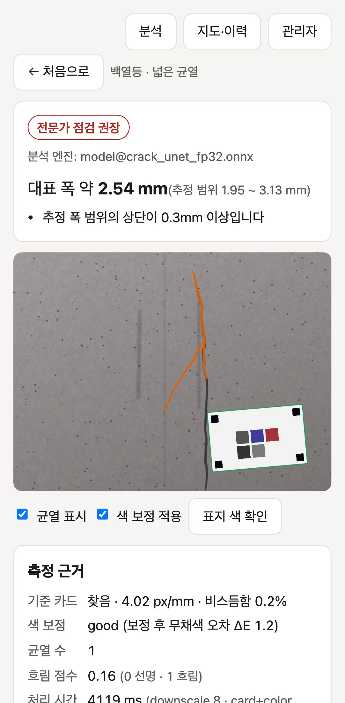
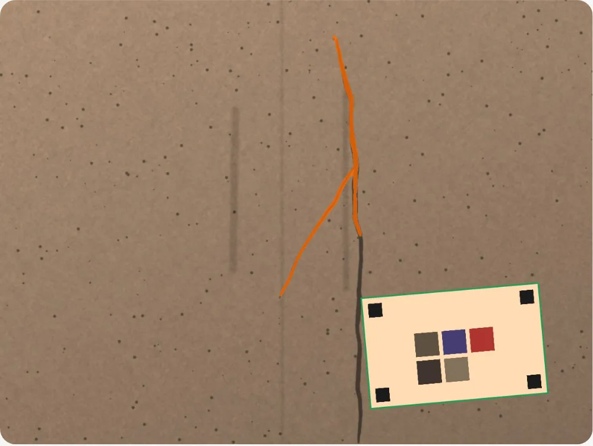
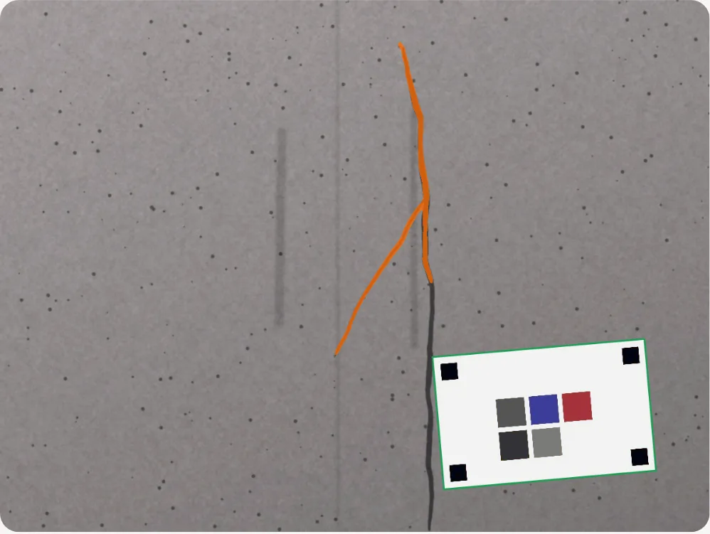

# 균열 감시 (crack-watch)

**시민이 찍은 벽면 사진에서 균열을 찾아 폭을 mm로 추정하고, 믿을 만한 신고만 걸러 지도에 쌓는 웹 앱.**

사진은 기기 안에서만 분석되고, 서버에는 폭·위치·사진 지문 같은 숫자만 저장된다.
**전문가 진단을 대신하지 않는다.** 화면의 안내는 `관찰 필요` / `전문가 점검 권장`까지이며, 건물이 안전한지 위험한지 판정하지 않는다.

| 결과 화면 (합성 샘플) | 기준 카드로 색 보정 — 전 / 후 |
| --- | --- |
|  | <br> |

## 데모

- **<https://crack-watch-thanksdooss.vercel.app>** — 로그인 없이 **샘플 3장**으로 체험(샘플은 합성 이미지, 실제 건물 아님)
- 로컬: 아래 '실행' 참고

## 무엇을 풀었나

원래 아이디어는 "늘어나면 붉게 변하는 필름(타 기관 기술)을 건물에 붙이고, 붉어지면 시민이 신고하게 하자"는 캠페인 기획서였다.
필름은 우리가 만들 수 없다. 대신 캠페인이 현실에서 무너지는 두 지점을 제품으로 만들었다.

1. **사진 속 색을 어떻게 믿을 것인가** — 같은 벽도 해질 무렵엔 주황, 형광등 아래선 초록빛으로 찍힌다. 인쇄용 **기준 카드** 한 장으로 색을 바로잡고, 같은 카드로 픽셀↔mm 축척과 비스듬히 찍은 왜곡까지 푼다.
2. **신고를 어떻게 걸러낼 것인가** — 거짓·중복 신고 한 번의 물결이 채널을 죽인다. 중복 묶기, 사진 재사용, 엉뚱한 위치, 도배를 **설명 가능한 규칙**으로 거르고, 걸린 신고는 삭제하지 않고 사유와 함께 보류한다.

## 성능 (숫자는 모두 `docs/`에서 재현 가능)

| 무엇 | 결과 | 조건 |
| --- | --- | --- |
| 균열 검출 (건물 벽면) | 허용 F1 **0.294 → 0.759**, IoU 0.115 → 0.413 | 고전 영상처리 기준선 → 학습 모델, CrackSeg9k test ([evaluation.md](docs/evaluation.md)) |
| 균열 없는 벽 헛경보 | **51% → 2.5%** | 같은 조건, 균열 없는 콘크리트 벽 163장 |
| 폭 추정 오차 | 0.3~1mm 균열에서 **0.256 → 0.104 mm** | 마스크 두께로 잴 때 → 원본 밝기 단면으로 잴 때, 합성 test(정답 폭을 앎) |
| 색 보정 | 최악 조건 색차 ΔE00 **14.0 → 2.6**, '붉은가' 오판 5/24 → 0/24 | 합성 조명 실험 ([color-calibration.md](docs/color-calibration.md)) |
| 신고 검증 | 나쁜 신고 자동 보류 **82.7%**, 중복 병합 100%, 정상 신고 억울한 보류 0.2% | 합성 신고 흐름, 사진 지문 거리는 실제 벽 사진으로 측정 ([verification.md](docs/verification.md)) |
| 처리 시간 | 데스크톱 브라우저 약 **1.1초**(모델) · 0.9초(고전 CV) / **휴대폰 미측정** | 1,200px 사진, WASM 1스레드. 배포본에서 교차 확인 |
| 모델 크기 | 6.2 MB (32비트) | 8비트 양자화는 정확도를 잃어 채택 안 함 |
| 첫 방문 다운로드 | 340 KB | 모델은 처음 분석할 때 받아 캐시 |

'합성'이라고 적은 수치는 실제 사진·실제 신고가 아니다. 알고리즘이 원리대로 도는지의 증거이고, 현장 성능의 증거가 아니다.

## 한계와 책임 범위

- **전문가 점검을 대체하지 않는다.** 사진 한 장으로는 균열의 깊이, 원인(구조·수축·온도), 진행 속도를 알 수 없다. 앱은 '누가 한번 봐야 하는 곳'을 모으는 도구다.
- 안내 기준 0.3mm는 건축물 안전점검 세부지침(2003, 건설교통부·한국시설안전기술공단)의 "응력에 의한 균열폭 0.3mm 초과 시 보수"에서 가져왔다. **판정이 아니라 안내 전환점**이고, 오차 범위의 상단이 닿으면 보수적으로 '전문가 점검 권장'을 띄운다.
- 폭은 **기준 카드와 균열이 같은 벽면에 있을 때만** 맞다. 카드가 없으면 mm를 내지 않는다(지어내지 않는다).
- 0.3mm 이하 가는 균열은 흐림 때문에 약 0.1mm 크게 잰다(합성 실험). 과대추정은 '점검 권장' 쪽이라 안전한 방향이지만, 값 자체를 믿으면 안 된다.
- 검출 모델은 공개 데이터(주로 도로·외벽 근접 사진)로 학습했다. 시민이 길에서 비스듬히 찍은 사진에서의 성능은 **아직 실측하지 않았다.**
- 신고 검증은 규칙 기반이라 **그럴듯한 가짜**(선명하고 균열도 보이는 엉뚱한 사진)는 거르지 못한다. '엉뚱한 건물' 신고는 3분의 1만 잡는다. 사람 검토가 필요하다.
- 사진 지문(지각 해시)은 원본 사진을 되살릴 수 없지만 **같은 장면인지는 알아볼 수 있다.** '프라이버시 문제가 없다'가 아니라 '원본보다 덜 민감하다'까지만 말할 수 있다.

### 지자체가 실제로 쓰려면 더 필요한 것

- 위치를 GPS 대신 **건물 대장(주소·동 번호)**과 연결 — GPS 오차가 25m로 나빠지면 중복 병합이 67%로 떨어진다.
- 관리자 인증을 기관 계정(SSO)으로, 조치 이력의 감사 로그 보존 기간 정책
- 실기기(중급 안드로이드·아이폰) 처리 시간과, 실제 벽을 캘리퍼스로 잰 폭과의 비교
- 시민이 찍은 실제 사진으로 모델 재평가, 양자화를 고려한 재학습(QAT)으로 모델 경량화
- 신고가 쌓였을 때의 사진 지문 검색 색인(BK-트리 또는 PostgreSQL 비트 연산)

## 구조

```
web/     Vue 3 + TypeScript PWA — 분석은 전부 웹 워커 안에서
  src/vision/      기준 카드 검출, 색 보정, 고전 CV, ONNX 모델 실행, 분석 파이프라인
  src/measure/     중심선 단면 폭 측정, px→mm 환산과 오차 범위, 안내 문구
  src/views/       분석·결과·신고·지도·이력·관리자 화면
api/     FastAPI + SQLAlchemy (SQLite / PostgreSQL)
  app/verify/      신고 검증 규칙(임계값은 rules.py 한곳)
  sim/             검증 시뮬레이션, 데모 데이터
ml/      학습·평가 스크립트 (노트북 아님)
shared/  pipeline.json — 전처리·카드 치수·임계값의 단일 출처 (웹과 파이썬이 같이 읽음)
         fixtures/golden — 웹 구현이 파이썬과 같은 답을 내는지 확인하는 골든 데이터
docs/    접근법, 아키텍처, 평가, 검증, 색 보정, 결정 기록
```

웹은 OpenCV.js 없이 필요한 영상처리만 TypeScript로 구현했다(약 10MB 절약). 파이썬과 같은 결과인지는 골든 테스트로 확인한다.

## 실행

```bash
# 파이썬 (API·학습·평가)
uv venv --python 3.11
uv pip install -e . --group dev              # API만 (가볍다 — 47MB)
uv pip install -e ".[cv]" --group dev        # 평가·테스트까지 (OpenCV·numpy 추가)
.venv/bin/uvicorn api.app.main:app --port 8000          # API (SQLite, 관리자 토큰 demo-admin)
.venv/bin/python -m api.sim.seed_demo                   # 지도 체험용 합성 신고 넣기

# 웹
cd web && npm install
echo "VITE_API_URL=http://localhost:8000" > .env.development   # 없으면 서버 없는 데모 모드
npm run dev
```

학습·평가를 다시 돌리려면 데이터셋을 받는다(저장소에는 이미지가 없다):

```bash
.venv/bin/python -m ml.datasets.download crackseg9k     # 약 2.8GB, 원 배포처에서
uv pip install -e ".[ml]"                              # 학습용(PyTorch 등)
.venv/bin/python -m ml.baseline.tune                    # 기준선 파라미터 (dev·val만)
.venv/bin/python -m ml.train.train --epochs 10 --crop 256
.venv/bin/python -m ml.export.onnx_export && .venv/bin/python -m ml.train.threshold --engine model-fp32
.venv/bin/python -m ml.eval.detection classic && .venv/bin/python -m ml.eval.detection model-fp32
.venv/bin/python -m ml.eval.detection render            # docs/evaluation.md
```

## 테스트

```bash
.venv/bin/python -m pytest -q                 # 색차·보정·카드 검출·폭·세선화·API 검증 규칙 (37개)
cd web && npx vitest run                      # 환산·골든(파이썬 일치)·카드·색·해시 (37개)
cd web && npm run e2e                         # 배포 빌드로 샘플 분석·업로드·신고·외부 전송 0건 (10개)
```

API 테스트는 `TEST_DATABASE_URL`로 PostgreSQL에서도 돈다.

## 배포

```
Vercel (웹: web/)  ──→  Vercel 함수 (서버: api/)  ──→  Neon (PostgreSQL)
```

- **웹** → Vercel 프로젝트, 루트 디렉터리 `web`, 환경 변수 `VITE_API_URL`=서버 주소 (`web/vercel.json`)
- **서버** → 같은 저장소를 두 번째 Vercel 프로젝트로(루트 디렉터리는 저장소 루트). FastAPI가 Vercel 함수로 돈다
  (`vercel.json`, `pyproject.toml`의 `[tool.vercel] entrypoint`). 환경 변수 `DATABASE_URL`·`ADMIN_TOKEN`·`CORS_ORIGINS`.
  **요청이 올 때만 실행되므로 잠들지 않는다.** API 의존성은 가볍게 유지했다(설치 47MB — 영상처리는 전부 기기 안에서 끝난다)
- **데이터베이스** → Neon 무료 PostgreSQL(만료 없음). 서버리스에서는 커넥션을 붙잡지 않도록 풀러 주소를 쓰고 `NullPool`로 붙는다.
  Render 무료 PostgreSQL은 30일 뒤 만료되어 쓰지 않는다
- **대안**: Render로도 올릴 수 있다(`render.yaml`). 다만 무료는 15분 뒤 잠들고(깨우기 워크플로 `keep-warm.yml` 포함),
  무료 시간이 계정당 월 750시간이라 다른 서비스와 나눠 써야 한다 — 자세한 건 `docs/next-steps.md` 부록 A
- **CI**: `.github/workflows/ci.yml` — 공개 금지 단어 검사어는 저장소에 두지 않고 `PRIVACY_TERMS` 시크릿으로

## 데이터셋과 라이선스

| 데이터 | 라이선스 | 쓰임 |
| --- | --- | --- |
| [CrackSeg9k](https://dataverse.harvard.edu/dataset.xhtml?persistentId=doi:10.7910/DVN/EGIEBY) (Kulkarni et al., ECCV Workshops 2022) | CC0 1.0 | 학습·평가 |
| [CIEDE2000 검증 데이터](https://www.ece.rochester.edu/~gsharma/ciede2000/) (Sharma, Wu, Dalal 2005) | 논문 부속 자료 | 색차 구현 검증 |
| 합성 벽면·샘플·기준 카드 | 이 저장소에서 생성 | 폭 정답 실험, 데모 |

- 저장소에 **데이터셋 이미지는 한 장도 없다.** 스크립트가 원 배포처에서 받는다.
- CrackSeg9k 중 원 배포처가 비상업·등록 조건을 명시한 하위 세트(DeepCrack·CFD·GAPs)는 **묶음의 CC0 선언과 관계없이 학습과 평가에서 뺐다.** 나머지 하위 세트도 원 저작자의 권리를 존중해 상업적 사용을 주장하지 않는다. 배포하는 것은 학습된 가중치뿐이다.
- 검토한 다른 데이터셋과 제외 사유: [docs/00-approach.md](docs/00-approach.md) 3절.
- 지도 타일: © OpenStreetMap contributors.

## 문서

- [00-approach.md](docs/00-approach.md) — 검출 방법 비교와 선택, 데이터셋 조사
- [01-architecture.md](docs/01-architecture.md) — 기기 내 분석, 서버는 숫자만, 규칙 기반 검증
- [evaluation.md](docs/evaluation.md) — 기준선 대비 모델, 폭 오차, 양자화, 처리 시간
- [verification.md](docs/verification.md) — 신고 검증 시뮬레이션과 사진 지문 임계값
- [color-calibration.md](docs/color-calibration.md) — 조명별 보정 전후 색 오차
- [decisions.md](docs/decisions.md) — 막힌 것과 고른 방법, 그때그때의 기록
- [story.md](docs/story.md) — 왜 시작했나, 용어 풀이, 불편 세 가지, 면접 대비 질문
